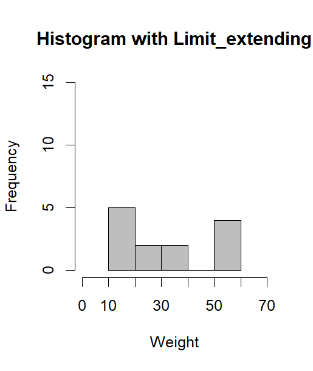

# Day 24: Data Visualization - Histograms

## 📝 Overview

Today’s session focused on **Histograms**, a specialized type of bar chart designed specifically to show the **distribution** of a continuous (numeric) dataset. While regular bar charts compare distinct categories, histograms group continuous values into ranges (aka bins) to reveal:

- Where data values are concentrated.  
- How much variation or spread exists.  
- The overall shape of the distribution.  

Histograms are one of the most important first steps when exploring any numeric variable.

## 📊 Histogram Fundamentals

In R, histograms are created using the built-in `hist()` function from the standard graphics package. The height of each bar represents the **frequency** of values falling within a specific range.

## 🛠️ The hist() Function

Takes a numeric vector as input and automatically divides the data into bins to display the distribution.

**Key Parameters**

- Data vector : Numeric values inputted as vector for the plot.  
- Main title : Whole chart title.  
- X-axis & Y-axis labels : It is Descriptive text for the axes  
- X-axis & Y-axis limits : Which manually control the displayed range  
- Breaks : It is number of bin boundaries  
- Fill color & border color : It customize appearance of the bars  

## 🔍 Key Features of Histograms

**Frequency Distribution**  
Quickly shows the shape of the data, whether it is symmetric, right-skewed, left-skewed, or has any outliers.

**Controlling Axis Limits**  
By default, R sets axis ranges based on the data. Manually setting limits helps with consistent comparison across multiple histograms .

**Controlling Bin Width (breaks)**  
The `breaks` parameter controls granularity:

- Fewer breaks → wider bars → broad overview.  
- More breaks → narrower bars → finer detail.  

## 🎨 Customization

Clarity is greatly improved with simple visual enhancements:

- Fill colors :  other soft tones for readability.  
- Clear axis labels : It is for entering the certain names for the x-axis and y-axis.  
- Descriptive titles :It is to provide immediate context.  

## 💡 Key Takeaways

The source code demonstrates creating default histograms, adjusting bin counts, setting axis limits, and identifying distribution shapes or gaps (e.g., missing values in certain ranges).

Histograms are often the **first visualization** created for any numeric variable.Which quickly reveal outliers, skewness, normality, and unusual patterns.

>[!IMPORTANT]  
>### Essential Setup
>The `graphics` package (containing `hist()`) is available by default in base R.

