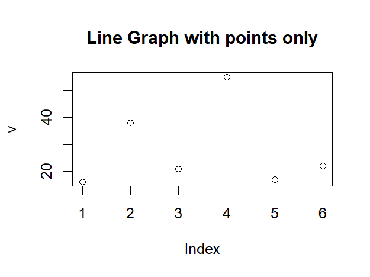
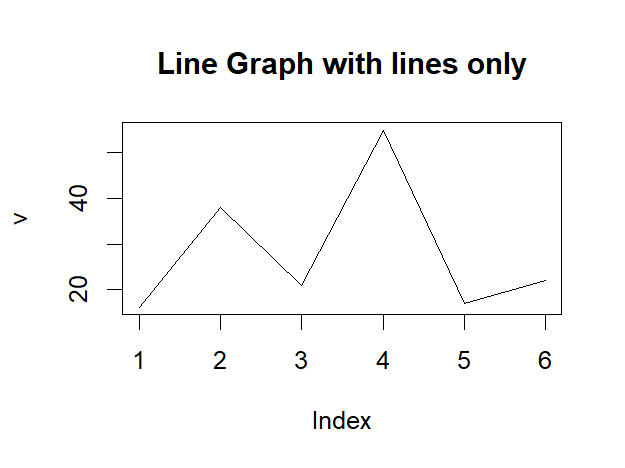
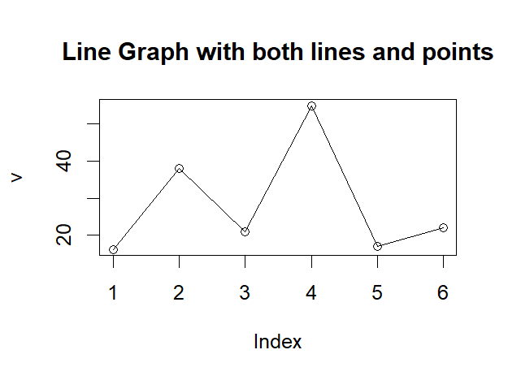
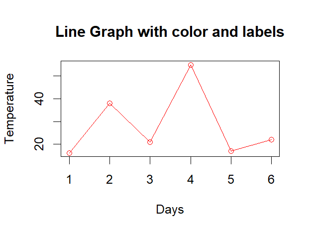
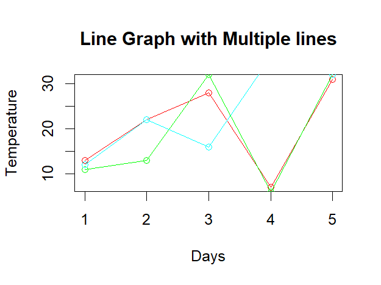

# Day 25: Data Visualization - Line Graphs

## 📝 Overview

Today’s session focused on **Line Graphs**, a fundamental visualization tool used to represent data points connected by straight line segments. Line graphs are particularly effective for:

- Showing **continuous change** over time or along a sequence.
- Revealing **trends**, **spikes**, **dips**, and overall patterns.
- Comparing multiple series on the same scale.

They are the go-to choice when the order of data points matters.

## 📉 Line Graph Fundamentals

In R, line graphs are primarily created using the built-in `plot()` function from the base graphics package. By adjusting parameters, you can switch between showing only points, only lines, or both.

## 🛠️ The plot() Function

Takes a numeric vector (or pairs of x and y values) and plots them with flexible styling options.

**Key Parameters**

- Data values : The numeric vector to be inputted.
- Main title : It is the whole chart title.
- Plot type : It controls whether points, lines, or both to be plotted.
- Color : It sets the color of lines or points.
- X-axis & Y-axis labels : It is for descriptive text for the axes.

## 🔍 Types of Line Visualizations

**Basic Line Styles**
You can choose to display:

- Points only
-  
- Lines only
-  
- Both lines and points
-  

## 🎨Color Differentiation**
Assign distinct colors to each line for easy visual separation.

**Multi-Line Charts**
R allows plotting multiple data series on the same graph to compare trends.

- Start with an initial `plot()` call for the first series.
- Use `lines()` to overlay additional series on the existing chart.

## 💡 Key Takeaways

Line graphs are the **standard choice** for **time-series data** or any sequential data where the relationship between consecutive points is meaningful like stock value over a particular period of time.

`plot()` starts a new chart, while `lines()` adds to the currently active plot. Effective layered visualizations.

>[!IMPORTANT]
>
>No external packages are required ,`plot()` and `lines()` functions are built into base R graphics and available by default.
