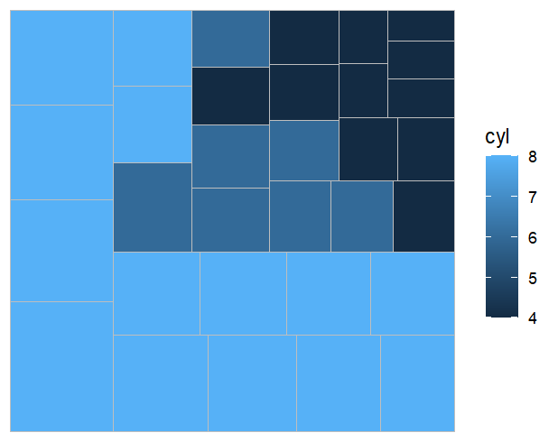
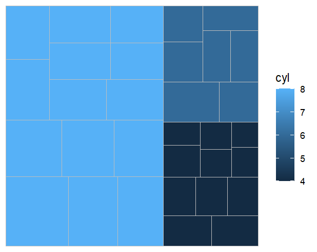
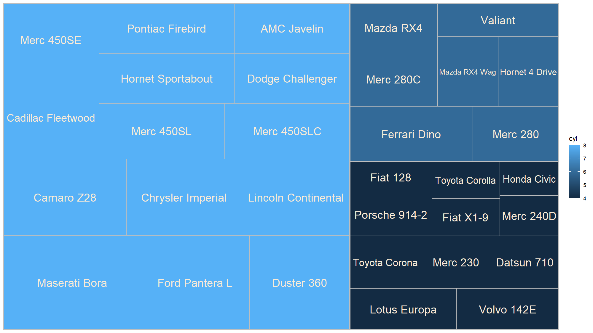
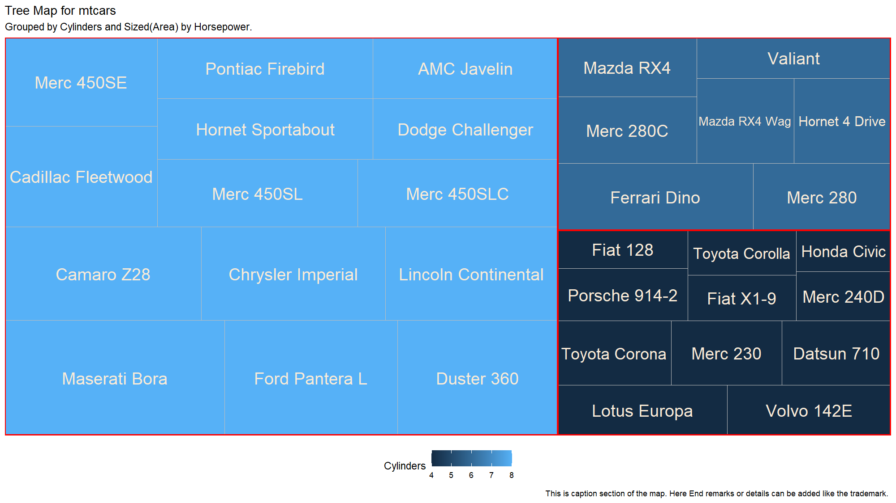

# Day 28: Data Visualization - Treemaps

## 📝 Overview

Today’s session focused on **Treemaps**, a powerful hierarchical data visualization technique. Unlike bar charts or pie charts, treemaps are designed to show **part-to-whole relationships** across multiple levels of categories simultaneously.

The area of each rectangle is proportional to its value, while color usually represents a specific group(or category) for making treemaps highly efficient for displaying large, hierarchical datasets in a compact, space-saving view.

## 🔍 Treemap Fundamentals

Treemaps in R are best created using the `treemapify` package, which extends the `ggplot2` system with dedicated geometry layers.This layered approach allows full customization while maintaining the clean, consistent grammar of graphics style.

## 🛠️ The geom_treemap() Layer

The core geometry is `geom_treemap()`, which maps data to rectangle sizes and colors.

**Key Aesthetics**

- Area : It is the numeric column that determines rectangle size.
- Fill : It is the categorical or we can say for  grouping variable that sets rectangle color.
- Subgroup : It is optional grouping to cluster related rectangles into larger blocks.
- 
- Label : It is the text to display inside each rectangle.
-

## 🛠️ Visualizing the mtcars Dataset

Used the built-in `mtcars` dataset to visualize how **Horsepower (hp)** is distributed across different engine types based on the number of **Cylinders (cyl)**.

**Basic and Grouped Treemaps**  
A basic treemap shows individual tiles sized by horsepower. Adding a subgroup aesthetic clusters tiles of the same cylinder count together into larger blocks.

**Adding Borders and Hierarchies**  
To make different cylinder groups visually distinct, a subgroup border layer draws thick outlines around each major category *(4, 6, and 8 cylinders)*.

**Adding Labels and Descriptions**  
Treemaps are only useful if viewers know what each rectangle represents. Text labels *(e.g., car model names)* are overlaid inside the tiles.

- Centered placement.
- Automatic text scaling to fit rectangle size.

## 🎨 Final Polished Visualization

The final step adds professional polish:

- [x] Clear titles and subtitles.
- [x] Descriptive captions.
- [x] Custom color scales for better aesthetics and readability.

## 💡 Key Takeaways

Their **space efficiency** allows hundreds of data points to be displayed clearly in a single view. 

Treemaps shine when showing **part-to-whole relationships** across multiple dimensions *(size = value, color = group, subgroup = hierarchy)*.

>[!IMPORTANT]
>To create treemaps successfully, install and load these packages:
>- **ggplot2** : It is the base for plotting engine and layering system.
>- **treemapify** : It provides the `geom_treemap()`, `geom_treemap_subgroup_border()`, and `geom_treemap_text()` layers.
