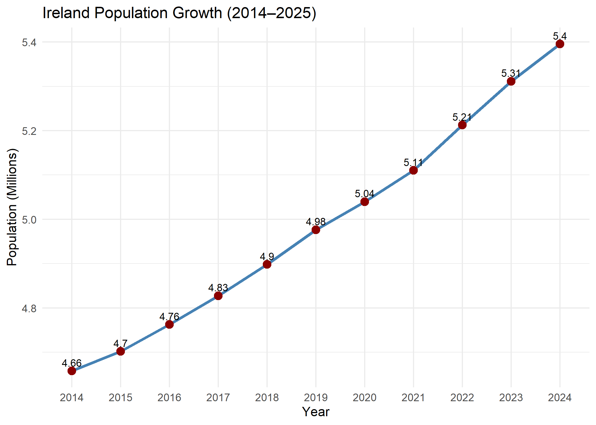
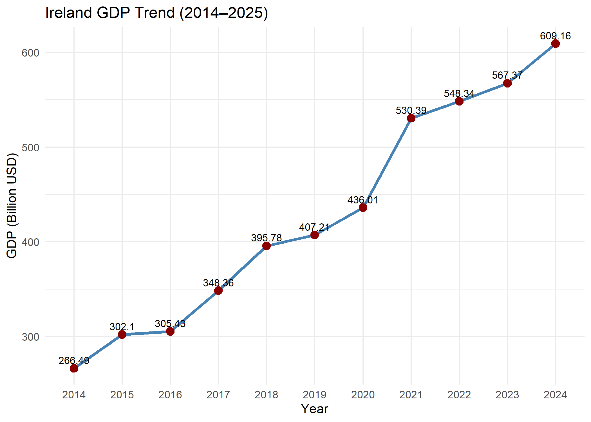
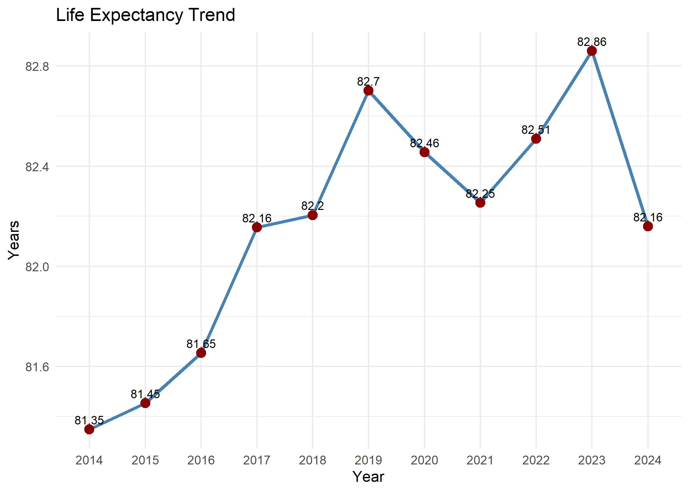
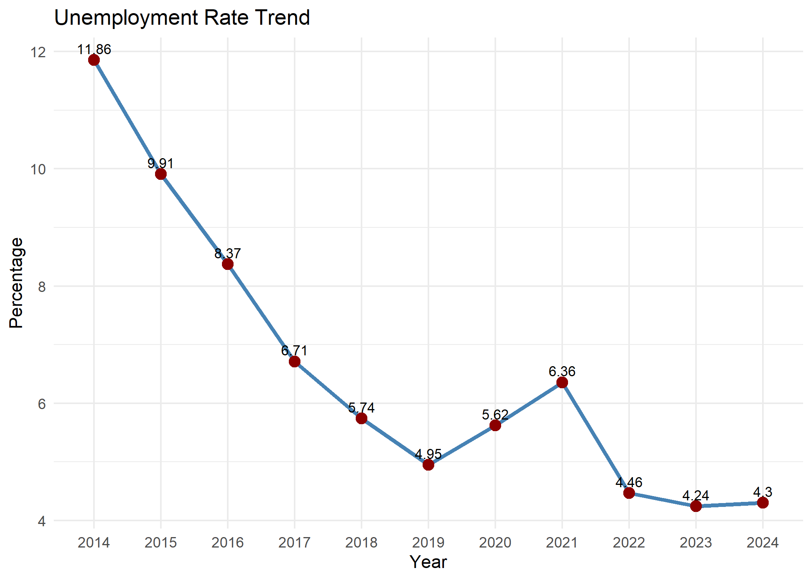

# Day 29: Advanced ggplot2 Functions & Final Project Prep

## 📝 Overview

Today’s session focused on **advanced `ggplot2` features** and preparation for the final project. 
- Fetching real-world data directly into R using the **World Development Indicators (`WDI`)** package.
- Handling large numerical scales on axes for better readability.
- Automating plot generation with custom functions.
- Saving both data and visualizations to disk for reporting.

## 🌐 Fetching Real-World Data (WDI)

Instead of relying solely on built-in datasets, the session introduced pulling live economic and demographic indicators from the World Bank.

**WDI() Function**

Fetches structured data using specific indicator codes and country/time filters.

**Indicators Used**

- Total Population
- Current GDP

**Application**
Pulled data for Ireland from 2014 to 2025 to analyze national growth trends.

## 📊 Refining Visuals with ggplot2

Large numbers like millions, billions for particular varaible often appear in scientific notation by default, which makes the plots complex to grasp.

**Formatting Scales**
Use `built-in` formatting functions to display numbers with commas.

**Categorical Time Axes**
Convert numeric years to factors on the x-axis so each year is treated as a distinct category.

**Automating with Custom Functions**
To avoid repetitive plotting code, create reusable custom functions that accept data, column names, titles, and labels as inputs.

This approach allows generating consistent charts ( for Population, GDP, Life Expectancy, Unemployment) with a single function call.
- 
- 
- 
- 

## 💾 Data Persistence & Exporting

**Exporting Data**
Save processed  to CSV for use in further reports. 
[SUMMARY_IRELAND.CSV](./summary_IRELAND.csv)

**Exporting Visualizations**
Use the standard `ggplot2` saving function to export high-quality images in various formats.

**Key Options**

- File name and path  
- Width and height

## 💡 Key Takeaways

Custom plotting functions make code cleaner, more maintainable, reusable and valuable for capstone projects.
Combining real-time data fetching with automated, high-quality plotting prepares you for professional-grade reporting and final project deliverables.

[!IMPORTANT]  
>To run the session successfully, install and load these packages:
>- **WDI** : For fetching World Bank indicators.  
>- **ggplot2** : For advanced layered plotting.

